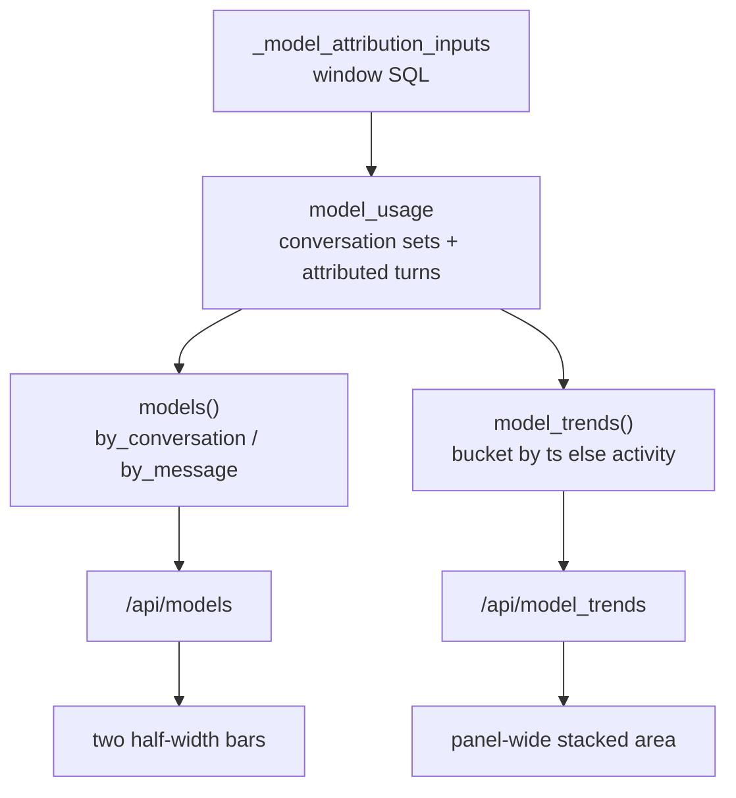

# TASK ARCHIVE: dashboard-model-analytics

## SUMMARY

Delivered dual-grain model analytics for [#67](https://github.com/Texarkanine/stockroom/issues/67) / [#68](https://github.com/Texarkanine/stockroom/issues/68): conversation- and message-grain top-model bars, a conversation stacked-area over time, shared sole-model Cursor attribution, and clean-break `/api/models` + `/api/model_trends`. One continuous undertaking — Level 3 ship, then Level 2 PR #70 rework (message-`ts` trend bucketing + time-only First-Prompt range labels), then post-reflect polish (sole-model dedupe of duplicate `sessions.models` entries). Shipped as [#70](https://github.com/Texarkanine/stockroom/pull/70) / release 0.12.0.

Final UI: **Top Models (by conversation)** and **Top Models (by message)** half-width bars; **Model Usage over Time** as one `panel-wide` conversation stacked area; shared per-model colors; Compare folds harnesses into the stack.

## REQUIREMENTS

1. Ranked model attention by conversation and by message (#67).
2. Stacked-area model mix over time (#68); operator amendment → conversation grain only for the area.
3. Stay on the offline read-only dashboard stack; no invented Cursor per-message models.
4. Shared attribution helpers for both grains and both chart families.
5. **Rework (PR #70):** bucket `model_trends` by message `ts` when present else session activity; First-Prompt `.panel-range` time-only for all presets (explanatory copy in help).
6. **Polish:** sole-model fallback treats repeated identical `sessions.models` names as one model.

## IMPLEMENTATION

### Lifecycle (one flight)

Started Level 3 (creative ×3 → plan → preflight → build → QA → reflect). Operator chose rework from CodeRabbit PR #70 (items 2 + 4); rework classified Level 2 (plan → preflight → build → QA → reflect). Item 3 added as post-reflect polish. This archive collapses both legs plus polish.

### Creative decisions (inlined)

#### Dual-grain attribution

**Selected: B — Sole-session-model fallback** (assistant turns). Conversation grain unchanged (union once per session). Message grain: use `messages.model` when set; else if `sessions.models` has exactly one model, attribute; else skip. Multi-model Cursor stays conversation-only for message grain. Time series: message buckets by `messages.ts` when present, else session activity (contract delayed into PR #70 rework).

#### Top-models presentation (#67)

**Selected: A — Two side-by-side half-width bars** with grain in titles. Avoids mixed-scale encoding and extra toggle chrome.

#### Over-time presentation (#68)

**Originally C (two wide areas); operator amendment → A — one `panel-wide` conversation stacked area.** Message grain remains ranking-only on the right. Write-read stays `panel-wide` after efficiency/first-prompt; model over-time uses `fill: true` stacked areas with shared `colorForModel`.

### Rework & polish

- Extended `MessageRow` / `attributed_turns` with optional `ts`; `model_trends` buckets `message_ts or session_activity`; window filter stays session activity.
- `panelRangeLabels(...).firstPrompt` and HTML seed are bare window labels; `PANEL_HELP["first-prompt"]` keeps average-session-length meaning.
- Sole-model path dedupes identical names in `sessions.models` before the “exactly one” check.

### Key files

| Area | Paths |
|------|--------|
| Attribution / API | `dashboard/model_usage.py`, `dashboard/metrics.py` (`models`, `model_trends`, `_model_attribution_inputs`), `dashboard/server.py` |
| Client | `static/dashboard-core.mjs`, `dashboard-data.mjs`, `dashboard.mjs`, `index.html` |
| Tests | `tests/test_dashboard_model_usage.py`, `test_dashboard_metrics.py`, `test_dashboard_static.py`; `tests-js/dashboard-core.test.mjs`, `dashboard-data.test.mjs` |

## TESTING

- TDD throughout: attribution helper → dual-grain ranking → trends bucketing → panel builders / inventory pins → rework ts + label cases → sole-model dedupe.
- `/niko-preflight` PASS (L3 + L2 rework; plan amendments for `model_usage.py` and per-step test-first wording).
- `/niko-qa` PASS both legs (L3: DRY shared window load; L2: clean).
- Final verification: dashboard py/js + full `make test` green (rework report: 604 py / 92 js).

## LESSONS LEARNED

### Technical

- When two metrics share grain rules, extract attribution before ranking/bucketing — the SQL load can also be shared once the pure helper exists.
- Extending a pure attribution row/tuple with optional timestamps is cheaper than a second SQL path that re-implements attribution in metrics.
- `make test-dashboard-py` globs `test_dashboard_*.py`; new modules must match that prefix or they silently drop out of the slice.
- Grain flips and bucket-key contracts should ship together — the creative already specified message-time bucketing; lagging it created the rework.

### Process

- Operator visual/layout amendments after preflight can stay plan amendments when they only change presentation grain, not architecture — document and continue rather than re-preflight.
- Choosing rework over archive mid-flight is fine for one continuous deliverable — archive once at the end with both legs inlined.

### Million-dollar question

Had message-time bucketing landed when message grain shipped in the polish commit, the PR #70 rework would not have existed. The elegant version is “grain change and bucket key change land together.”

## PROCESS IMPROVEMENTS

- When a creative contracts a time-series bucket key alongside a grain change, treat the bucket key as part of the same TDD step as the grain flip — not a follow-up polish item.
- Nothing else notable: L3 creative → plan → preflight → build → QA fit the foundation; L2 loop fit the review rework.

## TECHNICAL IMPROVEMENTS

Nothing deferred beyond ordinary product backlog. Cursor multi-model message grain remains intentionally empty (honesty); no fake fan-out planned.

## NEXT STEPS

None required for this undertaking. Issues #67 / #68 are addressed by the shipped behavior.
