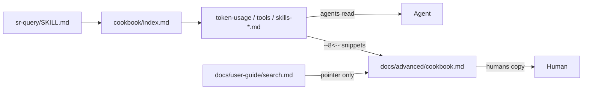

# TASK ARCHIVE: query-cookbook

## SUMMARY

Shipped a dual-audience `sr-query` cookbook for [#69](https://github.com/Texarkanine/stockroom/issues/69): recipe SSOT under `skills/sr-query/references/cookbook/`, Advanced docs that `pymdownx.snippets`-include those bodies, discoverability links from `SKILL.md` that keep Level-1 inline examples, and a user-guide pointer-only into Advanced. Recipes cover `session_token_usage` VIEW starters, unbounded/high-LIMIT tools SQL, and pure SQL skill-use for Claude and Cursor (operator override vs creative’s Level-3 surface-card preference for skills), with extractor drift caveats and a Claude builtin denylist sync test. Merged as [PR #76](https://github.com/Texarkanine/stockroom/pull/76).

## REQUIREMENTS

From the project brief:

1. Implement Option B from creative: SSOT under `skills/sr-query/references/cookbook/`; docs Advanced pages snippet-include recipe bodies; discoverable from `sr-query`.
2. Populate recipes for VIEW/`session_token_usage` starters; pure SQL skill-use (Claude + Cursor); pure SQL tool-use — as in #69.
3. Thoughtfully cross-link from in-skill docs: cookbook where appropriate; keep useful inline examples; do not bury answers behind a vague “load the cookbook.”
4. Discoverable: index from `SKILL.md`, human TOC under `docs/advanced/`.
5. Update `properdocs.yaml` comment for intentional dual-audience cookbook includes.

**Constraints:** one SSOT for recipe bodies; no user-guide corpus under `references/`; user-guide pointer-only; document drift triggers for skill/tool SQL; dual-manifest plugin conventions for shared `skills/` tree.

**Acceptance (all met):** cookbook tree with index + recipes; docs snippet mirror builds clean; SKILL discoverability without stripping worked examples; operators can answer full skills/tools tables and token rollup starters from the cookbook.

## IMPLEMENTATION

### Creative decision (Option B + promotion ladder)

Evaluated:

| Option | Summary |
|--------|---------|
| A | Skill-only cookbook; docs link out (no snippets) |
| **B** | Skill SSOT + `pymdownx.snippets` mirror into Advanced docs |
| C | Docs-owned cookbook; agents deep-link to site |
| D | Named engine recipes / `stockroom cookbook` CLI |

**Selected: B** — agent-primary SSOT under the skill tree; docs wrappers own human when/why and `--8<--` recipe bodies so the site gets copy buttons without cloning SQL. Rejected C (agents need local plugin files). Deferred D until recipe count or CI SQL verification demands it.

Creative also defined a **promotion ladder** (ad hoc → Level-1 inline → Level-2 cookbook SQL → Level-3 VIEW/Python/CLI). For #69 it preferred skills as Level-3 surface cards (not reverse-engineered SQL). **Operator override (2026-07-20):** ship pure SQL skill extraction per harness as in #69, with caveats and drift triggers pointing at `skill_usage.py` / dashboard tests. Plan recorded the override so build did not re-litigate architecture.

Snippet verdict: intentional dual-audience includes are desired; the old “not a snippet farm” comment was about mindless fragment sprawl, not a deliberate cookbook mirror.

### Approach

TDD plan held end-to-end:

1. Failing structural tests in `skills/sr-search/tests/test_query_cookbook.py` (paths, SKILL link, docs `--8<--` markers, nav, Claude `_CLAUDE_BUILTIN_COMMANDS` ⊆ `skills-claude.md`).
2. Cookbook SSOT: `index.md`, `token-usage.md`, `tools.md`, `skills-claude.md`, `skills-cursor.md`.
3. Agent discoverability: Cookbook section + selective “more variants” pointers in `sr-query/SKILL.md` (and related routing where warranted); inline worked examples kept.
4. Human docs: `docs/advanced/cookbook.md` + `.pages` / index mention; `search.md` pointer-only.
5. `properdocs.yaml` comment; surgical `systemPatterns.md` docs-ownership sentence for cookbook SSOT + snippet includes.
6. Full suite + strict `make docs-build`; warehouse smoke on tools, tokens, skills-claude.

### Build friction

Relative peer `.md` links inside snippet-included recipes break strict mkdocs link validation (resolved against `docs/advanced/`, not the SSOT directory). Fix: omit peer links in recipe bodies; use plain filenames or absolute docs anchors. Dual-audience-safe recipe shape (title + when + SQL + caveats) held once that constraint was respected.

### Key files

| Area | Paths |
|------|--------|
| Cookbook SSOT | `skills/sr-query/references/cookbook/{index,token-usage,tools,skills-claude,skills-cursor}.md` |
| Agent discoverability | `skills/sr-query/SKILL.md` (Cookbook section + selective pointers) |
| Human docs | `docs/advanced/cookbook.md`, `docs/advanced/.pages`, `docs/advanced/index.md`, `docs/user-guide/search.md` |
| Config / patterns | `properdocs.yaml`, `memory-bank/systemPatterns.md` |
| Tests | `skills/sr-search/tests/test_query_cookbook.py` |
| Drift reference (read-only) | `stockroom.dashboard.skill_usage` (`_CLAUDE_BUILTIN_COMMANDS`), `metrics.tools` filters |

### Non-goals (held)

- No `stockroom skills` CLI / new VIEWs for skill events.
- No replacing dashboard extractors with SQL.
- No warehouse schema / CLI / dashboard API changes.
- Do not commit `.cursor/skills/stockroom-local/` (symlink tree).

## TESTING

- Structural pytest: cookbook paths exist; `SKILL.md` → cookbook index; Advanced page has `--8<--` for each recipe; nav lists Cookbook; every `_CLAUDE_BUILTIN_COMMANDS` member appears in `skills-claude.md`.
- Docs: strict `make docs-build` (`check_paths: true`) after snippet wiring.
- Manual warehouse smoke: tools, tokens, skills-claude recipes via `stockroom query`.
- `/niko-preflight` PASS — amended plan with denylist sync test, clearer per-step TDD, required systemPatterns sentence.
- `/niko-qa` PASS — no substantive or trivial defects; multiple H1s on Advanced page (one per included recipe) accepted as copy-button UX, not a plan defect.
- Full suite green at build completion.

## LESSONS LEARNED

### Technical

- Recipe bodies that are snippet-included into docs must not use relative `.md` peer links — mkdocs resolves them against the wrapper page path, not the SSOT directory. Prefer plain filenames or absolute docs anchors.
- Pinning a recipe denylist to a Python frozenset via a structural test (`_CLAUDE_BUILTIN_COMMANDS` ⊆ recipe text) is a cheap, durable drift pin when documenting extractor-adjacent SQL.

### Process

- When a creative decision and an operator override disagree, recording the override in the plan (with rationale) keeps build from re-litigating architecture mid-implementation.
- Preflight amendments that tighten TDD ordering and add one sync assertion removed the main drift/docs-ownership risks before code.

## PROCESS IMPROVEMENTS

- For dual-audience snippet includes, treat “no relative peer links in included bodies” as a plan challenge/mitigation up front (or a structural hygiene check), not a build surprise.
- Nothing else notable: L3 plan → preflight → build → QA → reflect fit this docs-and-wiring feature cleanly.

## TECHNICAL IMPROVEMENTS

Nothing deferred as required follow-up. Optional later promotions already named in creative: Option D (`--recipe` / cookbook CLI) if recipe count or CI verification of SQL bodies becomes painful; `stockroom skills` CLI if operators need tabular skill use outside the dashboard.

Cosmetic only: Advanced cookbook page accumulates multiple H1s from included recipes — acceptable; could flatten heading levels later if TOC noise bothers operators.

## NEXT STEPS

None required for this undertaking. Issue #69 intent for the scoped recipe set is satisfied. Future cookbook recipes should clear the promotion-ladder bar and keep dual-audience-safe bodies (no docs-relative peer links).
