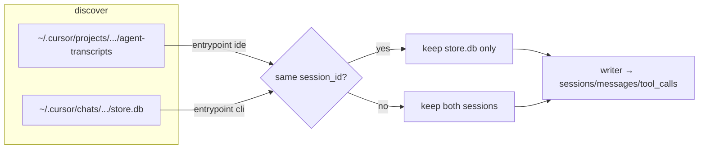

# TASK ARCHIVE: cursor-cli-and-entrypoint-ingest

## SUMMARY

Shipped Cursor Agent CLI chat ingest from `~/.cursor/chats/**/store.db` under `harness='cursor'`, added nullable `sessions.entrypoint` (Claude native passthrough; Cursor synthesized `cli` / `ide` from provenance), and deduped Cursor `session_id` collisions preferring the chats store over `agent-transcripts`. Warehouse/SQL only — no dashboard UI. Merged as [PR #80](https://github.com/Texarkanine/stockroom/pull/80) (`feat(ingest): Cursor CLI chats and sessions.entrypoint`).

## REQUIREMENTS

From the project brief:

1. Ingest Cursor Agent CLI sessions from `~/.cursor/chats/<hash>/<uuid>/store.db` under `harness='cursor'`.
2. Add session-level `sessions.entrypoint`.
3. Claude: pass through native `entrypoint` when present.
4. Cursor: synthesize from provenance only (`cli` for store.db, `ide` for agent-transcripts) — no system-prompt heuristics.
5. Same Cursor `session_id` in chats + transcripts → ingest once; `store.db` wins.
6. No dashboard UI changes.

**Constraints:** Linux-first roots only; harness brands stay `cursor` / `claude`; TDD and existing migration patterns.

**Acceptance (all met):** CLI as `cursor`+`cli`; IDE as `ide`; Claude passthrough; collision preference; migration 0008 + writer coverage; dashboard untouched.

## IMPLEMENTATION

### Creative decision (store.db parse)

Evaluated:

| Option | Summary |
|--------|---------|
| **A** | Ordered root-hash walk from `latestRootBlobId` (repeated 32-byte protobuf bytes fields); JSON user/assistant leaves only |
| B | Unordered JSON collect + invented sort |
| C | Prefer agent-transcript for order when same id exists |
| D | Full blob-graph BFS/DFS |

**Selected: A** — matches CLI conversation order for chats-only sessions (the common case); single-source clean-room parser; root blob is already a linear id list so D is redundant. Tradeoff: depends on Cursor keeping a flat hash list; production fails soft on layout/sqlite errors; fixture tests fail loudly on drift.

Session mapping notes from creative: `session_id`/`agent_id` = directory name; `title` from `meta.name`; `entrypoint='cli'`; `started_at` from `createdAt` ms; `cwd` best-effort from Workspace Path in `user_info`; `project_id` = parent hash dir; `models` optional from `lastUsedModel`; drop tool-result / reasoning parts.

### Approach

TDD plan held end-to-end (schema → model/writer → parsers → discovery → orchestrator → docs → verify):

1. Migration `0008_entrypoint.sql` — `ALTER TABLE sessions ADD COLUMN entrypoint TEXT;` + golden schema / `test_schema_0008.py`.
2. `NormalizedSession.entrypoint` + writer INSERT.
3. Claude first-seen native `entrypoint` passthrough.
4. Cursor IDE parser stamps `entrypoint='ide'`.
5. New `ingest/cursor_chats.py` ordered root-hash parser + synthetic fixture under `tests/fixtures/ingest/cursor_chats/`.
6. `STOCKROOM_CURSOR_CHATS_ROOT` / `cursor_chats_root()` / chats discovery with independent `_sync_state` watermark.
7. Orchestrator: dual Cursor roots; collision filter uses **all discovered** chats ids (not only watermark-selected); prefer store.db; CLI exempt from `encode_for` cwd roundtrip.
8. Docs: `docs/user-guide/ingest.md`, `docs/architecture/warehouse.md`, sr-query schema blurbs; `--full` for backfill of structural-only migration.
9. Full suite green (648 pytest + 92 JS at build complete).

### Build friction

- Head-version pins (`_HEAD_VERSION` / warehouse locked snapshot / migrate-runner tests) needed bump to 0008 — not listed as its own plan step; became the only full-suite red until fixed.
- Corpus `encode_for` roundtrip invariant had to exempt `entrypoint='cli'` because chats hash dirs are not encode slugs.

### Key files

| Area | Paths |
|------|--------|
| Schema | `skills/sr-search/src/stockroom/migrations/0008_entrypoint.sql`, `tests/test_schema_0008.py`, schema fixtures |
| CLI parser | `skills/sr-search/src/stockroom/ingest/cursor_chats.py`, `tests/test_ingest_cursor_chats.py`, `tests/fixtures/ingest/cursor_chats/` |
| Discovery / orchestrator | `ingest/sources.py`, `ingest/__init__.py`, `tests/test_ingest_sources.py`, `tests/test_ingest_orchestrator.py` |
| Model / writer / IDE / Claude | `ingest/model.py`, `ingest/writer.py`, `ingest/cursor.py`, `ingest/claude.py` + corresponding tests |
| Docs / patterns | `docs/user-guide/ingest.md`, `docs/architecture/warehouse.md`, `memory-bank/systemPatterns.md` (dual Cursor roots + CLI cwd/`project_id` exception) |

## TESTING

- TDD throughout plan steps 1–8; fixture-backed CLI parser tests; orchestrator collision + dual-root watermark tests.
- Full `skills/sr-search` suite at build complete (648 pytest + 92 JS).
- `/niko-qa` PASS — trivial nits only (docstring whitespace; `createdAt` ms comment); no substantive findings.
- Optional manual `stockroom ingest --full` smoke skipped as non-blocking after automated suite green.

## LESSONS LEARNED

- Cursor CLI `project_id` (chats hash) breaks the IDE/Claude “cwd must re-encode to project_id” invariant — document and test the exemption explicitly.
- Collision filters must use the full discovered chats id set, not only watermark-selected chats, or incremental runs can re-admit transcripts for already-ingested CLI sessions.
- When adding a numbered migration, treat head-version pin updates (`test_warehouse_open`, `test_warehouse_concurrency`, `test_migrate_runner`, locked snapshot) as part of the schema step.
- Ordered root-hash walk translated cleanly from creative; no alternate walk needed in build.

## PROCESS IMPROVEMENTS

- Schema tasks should checklist “bump `_HEAD_VERSION` / warehouse locked snapshot” when adding a migration, so it is not leftover fallout from “run full suite.”
- Preflight naming of orchestrator/golden test files paid off for TDD-before-code on the dual-root step.

## TECHNICAL IMPROVEMENTS

None beyond the process note on migration head-pins — no new architecture suggestions surfaced that were left unimplemented.

## NEXT STEPS

None for this feature. (A separate standalone creative on Cursor token counts via `state.vscdb` enrich vs primary pivot was explored outside this task and is **not** part of this archive.)
