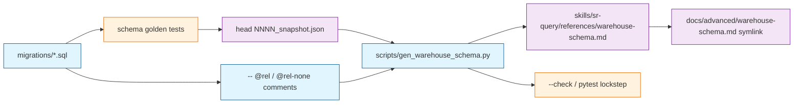

# TASK ARCHIVE: warehouse-schema-docs

## SUMMARY

Shipped a query-facing Mermaid ERD of the warehouse for [#127](https://github.com/Texarkanine/stockroom/issues/127), opened as [PR #128](https://github.com/Texarkanine/stockroom/pull/128). Boxes and columns come from the head schema golden snapshot; logical edges come from `-- @rel` / `-- @rel-none` comments in the migration SQL. A stdlib generator splices the diagram into the one mermaid fence of `skills/sr-query/references/warehouse-schema.md`; Advanced docs symlink the same file. `make schema-docs-check` and engine CI fail when the fence drifts. No dummy DuckDB; no plugin install required to regenerate.



## REQUIREMENTS

From the project brief (issue #127 plus operator refinements: generator elegance, CI drift, no localdev install):

1. Visual warehouse schema (Mermaid ERD) in the `sr-query` skill (ride-along resource OK).
2. The same visual in human docs.
3. Authoritative DDL remains the migration chain; generated artifacts are derived, committed, and lockstepped.
4. CI fails when schema-affecting changes land without a commensurate generator update.
5. An average local developer can run the same generator CI runs.
6. Prefer no dummy DuckDB if an equally faithful approach exists.
7. Generator and CI work without a local stockroom plugin install.

**Constraints:** committed layout equals install layout; PPL-S for skill payload; Architecture stays doctrine (no DDL dump); this checkout was not assumed to have an on-path `stockroom`; forward-only numbered SQL migrations remain schema source of truth.

**Acceptance (all met):** ERD in skill + Advanced docs; derived from migrated schema (goldens + `@rel`), not a hand sketch; documented `make schema-docs` / `--check`; plugin still has no build step. Live `information_schema` is optional inspection, not the primary map.

## IMPLEMENTATION

### Creative

Skipped. Dummy DuckDB vs head golden was decided in complexity analysis. Dual-audience placement followed the cookbook (skill SSOT + Advanced symlink). Operator chose `-- @rel` comments from a preflight advisory instead of a Python `RELATIONSHIPS` list. Operator rejected `-- @doc` / harvesting inline SQL comments as a data dictionary: layered migrations are a write log, not a glossary.

### Approach

TDD-ordered plan (10 units after `@rel` was folded in):

1. Stdlib generator + `@rel` parser (toy render, coverage, write/check).
2. Annotate `0001` / `0007` with `@rel` / `@rel-none`; repo coverage.
3. Commit SSOT + lockstep.
4. Dual-audience symlink + Advanced `.pages` nav (strict omitted_files).
5. Make `schema-docs` / `schema-docs-check`; ruff `scripts/` from engine cwd (`../../scripts`).
6. Engine CI: lockstep step + ruff covering `../scripts` (CI does not call `make lint`).
7. `sr-query` SKILL: point at ERD; drop version-pinned column catalog.
8. Human docs routing (Advanced, Search, Architecture pointer only).
9. Contributor regen loop in `docs/contributing/iteration/engine.md`.
10. Surgical `techContext` / `systemPatterns` pointers.

**Comment grammar:** `-- @rel <from>(<cols>) -> <to>(<cols>) [: <label>]` (Mermaid `to ||--o{ from`); `-- @rel-none <entity>`. Coverage: every head-snapshot table is a from, a to, or rel-none; names and listed columns must exist on the snapshot.

**Views:** empty `primary_key` in the golden → Mermaid entity alias `name["name (view)"]` (box title). Relationship ids stay the SQL name. `%%` comments do not render.

**Post-QA / post-reflect on the PR:**

- Generator no longer writes the whole markdown page. `render_er_diagram` emits only mermaid source; `splice_mermaid` replaces the one ` ```mermaid ` fence. Surrounding prose is authored. `--check` fails only when the diagram is stale.
- SKILL dropped the live `information_schema` *verify-the-picture* block (CI lockstep is that gate). Compact meanings remain: `project_id` / `cwd` / `workspace_key` / `entrypoint`, thinking not captured, tool inputs only. Join rules, token VIEW, `_sync_state` note kept. An optional inspect-live-schema query may still appear as a convenience, not as the map.
- Dual-path relative-link lock: pytest asserts `_RELATIVE_MD_LINK` against the committed SSOT page (skill path vs Advanced symlink), not against mermaid source.

### Key files

| Area | Paths |
| --- | --- |
| Generator | `scripts/gen_warehouse_schema.py` |
| SSOT | `skills/sr-query/references/warehouse-schema.md` |
| Docs symlink | `docs/advanced/warehouse-schema.md` |
| `@rel` comments | `skills/sr-search/src/stockroom/migrations/0001_initial_schema.sql`, `0007_session_token_usage.sql` |
| Tests | `skills/sr-search/tests/test_warehouse_schema_docs.py` |
| Wiring | `Makefile`, `.github/workflows/ci.yaml`, `docs/advanced/.pages` |
| Agent / human routing | `skills/sr-query/SKILL.md`, Advanced/Search/Architecture/contributing engine docs |
| Standing contracts | `memory-bank/techContext.md`, `memory-bank/systemPatterns.md` |

### Non-goals (held)

- No `stockroom schema` CLI.
- No dummy warehouse as SSOT.
- No generating skill files on `main` after merge.
- No `-- @doc` column-meaning harvest from migrations.

## TESTING

- Behavioral pytest: toy render, type sanitization, visible view aliases (rejects `%% view:`), `@rel` parse/coverage, splice preserves prose, write/check, committed SSOT mermaid lockstep, docs symlink, Make existence pin, dual-path relative-link lock on the authored page.
- Skill hygiene (wrapper skills still have no invocation plumbing).
- `make schema-docs-check`, `make lint`, `make format-check`, `make reuse`, `make docs-build`.
- `make test` with Node 22: dashboard JS passed; engine pytest passed aside from a pre-existing macOS `/tmp` vs `/private/tmp` identity failure unrelated to this task.
- `/niko-preflight` ended `PASS WITH ADVISORY` after folding CI ruff coverage of `scripts/` and the `@rel` rewrite (earlier `FAIL (fixable)` on the unlinted generator / CI ruff cwd).
- `/niko-qa` FAIL (round 1): `%% view:` not visible. FAIL (round 2): catalog deletion dropped non-structural meanings. PASS (round 3) after compact SKILL guardrails.
- PR review: retargeted the relative-link test from mermaid source to the committed dual-path page.

## LESSONS LEARNED

### Technical

- Mermaid `%%` never appears in the rendered ERD. A visible view label is an entity alias `name["name (view)"]`. Tests must assert that alias and reject comment markers, not search for the word `view` in the source.
- Schema documentation splits: goldens plus `@rel` own current *structure*; SKILL / Architecture own *meanings* the boxes cannot say. Do not generate a glossary from the migration write log — an older file can still contain a sentence a later migration made false.
- From `skills/sr-search` (`uv --directory` / Make `UV_RUN`), repo `scripts/` is `../../scripts`. `../scripts` is `skills/scripts`.
- After splice-only generation, a “no relative links” regex on mermaid source cannot fail. The dual-path contract lives on the authored page (same bytes at skill path and Advanced symlink).
- CI does not invoke `make lint`; ruff for `scripts/` had to be added on the engine job as well as Make.

### Process

- When a plan deletes a hand-maintained catalog in favor of a generated picture, write the residual prose list in that same unit. “Keep join rules” is not enough.
- A test that can pass on non-rendered syntax is not a test of the visual.
- Preflight advisories the operator accepts should be folded before Build; `@rel` instead of a Python edge list was the right cheap radicalism.
- Skipping creative did not hurt the ERD. It did mean the structure-vs-meaning split waited for QA.

## PROCESS IMPROVEMENTS

- Treat “what the picture cannot say” as a planning item whenever a generated diagram replaces a prose catalog.
- Dual-audience pages (skill SSOT + docs symlink): plan the link-free rule on the *page*, and keep generation to the mermaid fence so prose stays a real markdown document.
- Nothing else notable: L3 plan → preflight → build → QA → reflect fit; two QA FAIL (fixable) loops were the right mechanism.

## TECHNICAL IMPROVEMENTS

Optional, not required for this issue:

- Uniform `||--o{` cardinality on every edge (including the 1:1-looking token VIEW and polymorphic embeddings). The `@rel` grammar has no cardinality token; add one only if the picture is judged misleading.
- One ruff invocation shape in Make vs CI (`ruff check` then `ruff check ../../scripts` vs `ruff check . ../../scripts`).

## NEXT STEPS

None required for this undertaking. Issue #127 intent is satisfied on [PR #128](https://github.com/Texarkanine/stockroom/pull/128). Future schema changes: declare `-- @rel` / `-- @rel-none` in the same migration, update the head golden, run `make schema-docs`, commit comments + snapshot + spliced ERD together. Keep residual column meanings in `sr-query` / Architecture, not in migration comments.
