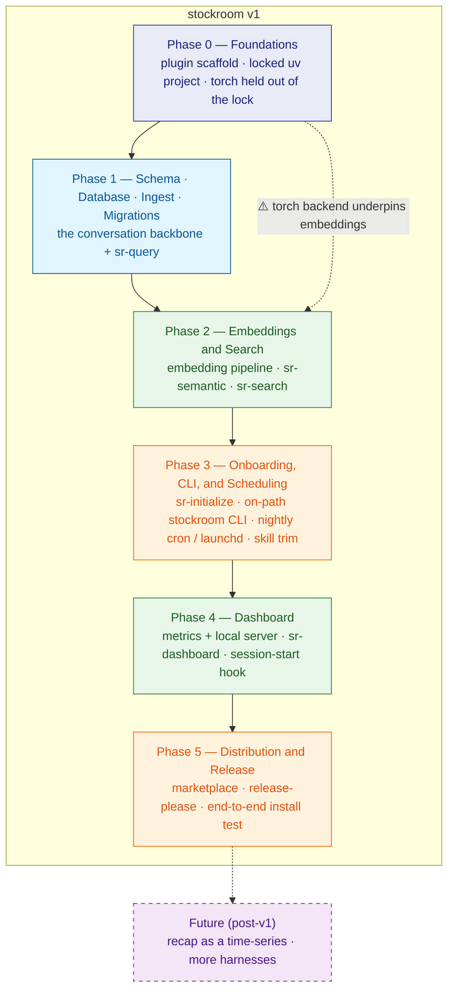

# Stockroom — Roadmap

*The authoritative build sequence for stockroom v1: the order it is built in, why that order, what each phase delivers, and how to know each phase is finished. Where the Product Brief says what stockroom is and the Tech Brief says how it is built, this says in what order it comes to exist.*

## The Spine

The intended end-to-end experience is a single unbroken motion: **install the plugin → run `sr-initialize` → it provisions torch, binds an on-path `stockroom` command, schedules overnight re-ingest/re-embed, and performs a first ingest + embed → open the dashboard to see what you've been up to → thereafter reach for `sr-search`, `sr-semantic`, and `sr-query` to interrogate your own history.** The build order tracks that motion from the bottom up, with one deliberate departure. The earliest phases lay down the trustworthy substrate and the faithful data backbone; the middle phase layers on the search surfaces; then onboarding wraps those proven parts into a one-command install — and because that same onboarding owns *how* the engine is invoked (the on-path CLI), it lands **before** the dashboard, which is then authored against that invocation contract rather than inventing its own. Release ships it. Each phase makes the *next* promise in the spine real, so that by the time onboarding is built it is orchestrating capabilities that already work rather than inventing new behavior under pressure.

## How to Read This Roadmap

Phases are ordered by **dependency, not by calendar** — there are no dates or estimates here, only a sequence in which each step is buildable because the steps it relies on already exist. Within each phase the work is expressed as **independently deliverable milestones**: each is concrete, self-contained, testable, and committable on its own, and small enough to be planned and built as a single focused unit. Every milestone is built **test-first**, per the workspace's TDD rule — the schema/ingest enumeration and the migration/concurrency suite especially, because faithful capture and "never break your warehouse" are promises that must be *proven*, not assumed.

Scope is settled. The roadmap does not re-litigate what is in or out of v1 — the Product Brief and Tech Brief fix that — and the **torch packaging question is already resolved**, proven end-to-end in the reproducible spike artifact at `planning/spikes/o9-torch/` (see the Tech Brief's "Torch Exception"). Decisions deliberately **left to build time** — the migration lock primitive, the dashboard's server and front-end stack, torch provisioning ergonomics — are resolved *inside the phase that needs them*, not up front. And like the Tech Brief, this document is forward-looking: once a phase lands real code and configuration, those artifacts (`pyproject.toml`, `uv.lock`, the migration SQL, the test config) become the source of truth, and this roadmap should defer to them rather than restating their drift-prone specifics.

## The Build at a Glance

The single non-linear edge is torch: the embedding work in Phase 2 stands on the torch contract established in Phase 0, even though torch itself is provisioned per-machine later, in `sr-initialize`. Everything else is a clean linear progression — foundations, then the data backbone, then search, then the one-command onboarding that both wraps those proven parts and establishes the on-path invocation contract, then the dashboard built on that contract, then release. Onboarding precedes the dashboard deliberately: it owns the shim/CLI and the drift-safe scheduling substrate that the dashboard's launch paths, the nightly job, and the trimmed wrapper skills all build on — so the fragile invocation incantation is established correctly once rather than reproduced across artifacts.

## Phase 0 — Foundations

Nothing stockroom does can be trusted until the ground it stands on is trustworthy, so Phase 0 builds exactly that substrate and no product behavior yet. Two things define it. First, the dual-manifest plugin skeleton — a `.cursor-plugin/` manifest and a `.claude-plugin/` manifest over a shared `skills/` tree, AGPLv3 already in place, with the committed layout equal to the install layout so there is no build step to go wrong; both manifests ship from the very start, so every later phase is exercised against both harnesses rather than one. Second, and more important, the locked `uv` project that is the entire reason stockroom exists as a productized tool rather than a pile of scripts: a real `pyproject.toml` and a committed `uv.lock`, generated hermetically so that a tool which reads every one of your conversations can never pull fresh, unaudited code into itself at run time. The one deliberate exception — torch — is already settled; Phase 0 *encodes* the proven recipe (exclude torch from the locked resolution, provision it out of band, never run an exact sync) rather than discovering it. A test, lint, and format harness is stood up here too, so that from the first line of real code in Phase 1 the work is genuinely test-first.

**Milestones**

- [x] **Dual-manifest plugin scaffold** — `.cursor-plugin/plugin.json` and `.claude-plugin/plugin.json` over a shared `skills/` tree, AGPLv3 confirmed in place, committed-layout-equals-install-layout (no build step); both manifests ship from the start.
- [x] **release-please wired** — `release-please-config.json` and its manifest configured to version stockroom and sync that version into both plugin manifests in lockstep.
- [x] **Locked uv project skeleton** inside the app-bearing skill directory — `pyproject.toml` (with `requires-python` and the torch-exclusion override) plus a hermetic `uv.lock` produced by `uv lock --no-config`; the torch-safe run contract (`uv run --no-sync` / `--inexact`, never an exact sync) documented as the project's standard invocation.
- [x] **Test, lint, and format harness** — the test framework configured in `pyproject.toml` with one trivial green test, plus formatter and linter, so every later phase is test-first from line one.

**Done when:** a fresh clone resolves the locked environment hermetically (entirely from PyPI, with hashes, no ambient-config leakage), the empty test suite runs green, both manifests validate, and release-please can cut a versioned release on demand — all with zero product code yet.

## Phase 1 — Schema, Database, Ingest, and Migrations

Phase 1 builds the faithful data backbone — the reason stockroom is worth using at all. It opens with the one task the Tech Brief deliberately deferred to the build: the **empirical schema enumeration**. The Tech Brief fixed the schema's *design and contract* (a normalized, harness-labeled split with first-class conversation reconstruction); here an agent is pointed at real Cursor and Claude Code transcripts side by side, enumerates every field each format exposes, and locks the concrete table DDL against that evidence — test-first, with fixtures drawn from real and pathological logs so faithful capture, linkage, and harness-generality are proven rather than hoped for. The migration framework lands immediately after, and on purpose: "never break your warehouse" is a core promise, retrofitting migrations onto a live schema is painful, and the initial schema ships as the very first migration. Only then does ingest fill the tables — ETL into stockroom's shape, content stored whole, tool inputs only, subagents linked to their parents, both harnesses from day one with Claude Code parsed clean-room from its own on-disk format. `sr-query` closes the phase as the first user-facing surface, proving the database is real and queryable end to end before any embedding work begins.

**Milestones**

- [x] **Schema field enumeration + locked DDL** — point an agent at real Cursor and Claude Code transcripts side by side, enumerate every exposed field, and lock one shared set of tables (sessions, messages, tool calls inputs-only, plan documents, embeddings, sync-state watermark) — each row carrying a `harness` column, never separate per-harness tables, so a query omits it for a cross-harness view or filters `WHERE harness = …` for one — with the stable message-identity contract and the conversation-reconstruction keys (conversation id, parent/child, ordering, subagent↔parent, model-per-chain); test-first against real and pathological fixtures. `cursor-warehouse`'s schema may be reused; `claude-warehouse`'s may not.
- [x] **Migration framework** — numbered one-per-file SQL migrations inside the skill, a `schema_version` record, the lazy gate (each consumer checks the version before touching the DB), forward-only application under an exclusive lock, and concurrency-safe reader degradation; the locked schema ships as the first migration. The lock primitive and reader wait/backoff semantics are chosen here.
- [x] **Trace ingest (ETL)** — incremental and per-source watermarked (`last_mtime` / `last_path`) with a `--full` reset; both Cursor and Claude Code (Claude Code parsed clean-room from its native on-disk format); subagents included and linked to their parent; kept content stored untruncated; tool inputs only, no outputs, no raw layer; WSL/Windows-mount-aware path resolution; optional model/labeling enrichment from Cursor's `ai-code-tracking.db` limited to model/labeling fields.
- [x] **`sr-query`** — raw SQL against the warehouse: the first user-facing surface, proving the database is real and queryable end to end.

**Done when:** a real ingest of the operator's own Cursor and Claude Code history lands faithfully — kept fields stored whole and verified against the source, subagents linked to parents — `sr-query` returns correct results over it, and the migration suite proves a schema-changing upgrade is safe and data-preserving under concurrent reader/writer load.

## Phase 2 — Embeddings and Search

With faithful content in the warehouse, Phase 2 makes it findable by meaning. The embedding pipeline is built first, standing on the torch contract from Phase 0: `sentence-transformers` with `all-MiniLM-L6-v2`, long text chunked and mean-pooled so a 200 KB field never threatens the embedder, vectors stored as `FLOAT[384]` and indexed with DuckDB's VSS/HNSW under cosine, GPU when available and CPU otherwise. Storage and embedding stay decoupled — full text in the store, bounded chunks to the model. `sr-semantic` exposes pure vector search for when meaning-based lookup is explicitly wanted; `sr-search` is the friendly default entrypoint that blends keyword and vector matching, decides which kind of lookup a question actually needs, merges and ranks, and applies a context-aware read-time truncation level so retrieving a huge field never floods the caller's context window. This is where truncation is demonstrably repositioned from a destructive storage default into a deliberate read-time feature.

**Milestones**

- [x] **Embedding pipeline** — local `sentence-transformers` (`all-MiniLM-L6-v2`, 384-dim), chunk-and-mean-pool of long text, `FLOAT[384]` storage, DuckDB VSS/HNSW cosine index (experimental persistence enabled so deletes work against a live index), GPU-or-CPU, and incremental re-embed of new content only; runs on the Phase 0 torch contract.
- [x] **`sr-semantic`** — pure vector search over the HNSW index, named so a keyword-search-seeker won't grab it by mistake.
- [x] **`sr-search`** — the blended keyword + semantic entrypoint: picks SQL, vector, or a blend per the question, merges and ranks, and applies a context-aware read-time truncation level — enough to answer without flooding the context window.

**Done when:** semantic and blended search return relevant results over the real ingested history, new content re-embeds incrementally rather than from scratch, and read-time truncation is demonstrably a feature — full content preserved in the store, sensibly trimmed on output.

## Phase 3 — Onboarding, CLI, and Scheduling

Phase 3 collapses everything built so far into the spine's one-command promise, and in the same motion establishes how the engine is *invoked* everywhere. `sr-initialize` checks prerequisites, detects the platform and accelerator, provisions the per-machine torch wheel using the proven out-of-band recipe, and smoke-tests it — printing the version, checking `cuda.is_available()`, and actually encoding one string — so a wrong-wheel mismatch is caught at setup rather than at first embed. It then binds an on-path `stockroom` command: a small tested `python -m stockroom` dispatcher over the existing modules, plus a generated `~/.local/bin/stockroom` shim that hard-codes the torch-safe run contract (`--no-sync --no-config`, `PYTHONPATH`, `APP_DIR`) in exactly one place, so no skill, cron entry, or hook ever reproduces the fragile four-part incantation again. The shim is **bake-then-verify** — a baked `APP_DIR` with a runtime re-resolution fallback — because harness plugin caches are versioned per release and a baked path goes stale on update; how that staleness is detected and healed is a decision made inside this phase (the open TODO in `planning/brainstorm/stockroom-on-path-cli.md`). `sr-initialize` then installs the nightly scheduler (cron on Linux, launchd on macOS) whose entries **invoke the shim** (`stockroom ingest`, `stockroom embed`), never a raw engine path — so no rendered-out artifact can bake a stale plugin-cache location (the operator's own box, with a legacy cron entry pinned to a slow Windows-mount path, is the standing cautionary tale). A first full ingest + embed leaves a populated, embedded, query-ready warehouse with no manual configuration. Finally, with the CLI in hand, a single trimming pass sweeps the three wrapper skills — swapping every invocation incantation for `stockroom <subcommand>`, applying the litter-audit inventory, and relocating the system-model rationale into a shared reference doc. This phase is also where the torch paths the spike only *reasoned* about — macOS/MPS and a cold, non-cached install — get validated on real target machines, folded into the smoke test.

**Milestones**

- [x] **`sr-initialize` — prerequisites, torch, and the on-path CLI** — prerequisite checks (uv present and usable), platform/accelerator detection, per-machine torch provisioning via the proven out-of-band recipe, and a torch smoke test (version, `cuda.is_available()`, encode one string) that fails loudly at setup on a wrong wheel; plus the on-path `stockroom` command — a tested `python -m stockroom` dispatcher over the existing modules (`query`, `semantic`, `ingest`, `embed`, `migrate`) and a generated bake-then-verify shim on PATH that owns the torch-safe run contract. The plugin-update staleness question (how a baked `APP_DIR` is detected stale and re-resolved) is decided here.
- [x] **`sr-initialize` — scheduling and first run** — nightly ingest + embed installed via cron (Linux) or launchd (macOS), the entries **invoking the shim** (`stockroom ingest` / `stockroom embed`, no raw engine paths in any rendered-out artifact) with correct resolution for the machine, followed by a first full ingest + embed that leaves a populated, embedded warehouse; Windows-native scheduling stays out of v1.
- [x] **Wrapper-skill trimming pass** — across `sr-query` / `sr-semantic` / `sr-search`: swap every invocation incantation for `stockroom <subcommand>`, apply the litter-audit inventory (rationale → a shared reference doc; task knowledge stays in the skill), add the one shared-doc pointer per skill, and re-run the m6 grep-verifiable no-invocation-token check.

**Done when:** a single `sr-initialize` run on a clean machine self-configures nightly freshness and produces a populated, embedded, query-ready warehouse with the torch smoke test green — validated on at least a Linux/CUDA path and a CPU-or-macOS path — the on-path `stockroom` command drives every engine call (skills, scheduler, and later the dashboard), and the three wrapper skills carry `stockroom <subcommand>` with zero invocation plumbing (grep-verified).

## Phase 4 — Dashboard

Phase 4 delivers the v1 headline UI, and with it the metric substrate that the future recap will be dragged through time. It is a light, standard-library-class local web server rendering an at-a-glance summary of usage and activity, with every front-end asset vendored into the repo — no CDN — to honor the offline and supply-chain posture, served on port 6767. The specific server and front-end stack are the build-time pick made here. There are two ways in: `sr-dashboard` launches it on demand and prints the local URL, and a single session-start hook launches it and nothing else — idempotent (probe the port, exit cleanly if it is already running), fire-and-forget (a detached background process), bounded by the hook timeout, and constitutionally unable to error. Both entry paths launch it through the on-path `stockroom` command established in Phase 3 (the dispatcher gains its `dashboard` subcommand here), so the hook body is a one-liner carrying no invocation plumbing. The hook never ingests and never migrates; that discipline is what keeps session start instant and safe.

**Milestones**

- [x] **Metrics + local server + vendored front-end** — a light/stdlib web server (framework chosen here) computing at-a-glance usage and activity metrics over the warehouse, all front-end assets vendored (no CDN), served read-only on port 6767; metrics designed as the time-series substrate for the post-v1 recap.
- [x] **`sr-dashboard` + session-start hook** — on-demand launch that prints the local URL, plus the single session-start hook that launches the dashboard only, both invoking it via the on-path `stockroom dashboard` subcommand (added to the dispatcher here): idempotent, fire-and-forget, bounded by the hook timeout, never erroring, and never ingesting or migrating.

**Done when:** the dashboard renders real metrics fully offline, `sr-dashboard` reliably surfaces the URL, and the session-start hook launches it exactly once regardless of how many sessions start — never erroring, never blocking session start, never touching the schema.

## Phase 5 — Distribution and Release

Phase 5 is the "clean enough to ship" gate. Stockroom is added to the separate `txrk9-agent-plugins` marketplace — both the Cursor and Claude marketplace entries, pointing at the source repo — with user-facing install and usage docs, and the exact per-harness invocation forms (`/sr-*` in Cursor versus the `<plugin>:<skill>` form in Claude) are verified empirically rather than assumed. The empirical surface is smaller than it once was: since Phase 3 the *engine* is invoked uniformly through the on-path `stockroom` command (PATH is PATH in both harnesses), so only the skill-invocation forms remain harness-specific to verify. Then the release-please release path is exercised end to end — the version syncing into both manifests — and the released plugin is installed from the marketplace on a clean machine to confirm the entire spine works for a real user: add the marketplace, install, run `sr-initialize`, and use all four surfaces against genuine Cursor and Claude Code history. That end-to-end install test *is* the v1 success criteria, demonstrated rather than asserted.

**Milestones**

- [x] **Plugin definition + install docs** — .cursor-plugin and .claude-plugin manifests added, with install and usage documentation and the per-harness `/sr-*` invocation forms verified empirically. Plugin can be installed manually.
- [x] **Marketplace entry** — stockroom added to `txrk9-agent-plugins` (both `.cursor-plugin` and `.claude-plugin` marketplace entries pointing at the source repo).
- [x] **Release flow + end-to-end install test** — the release-please release path exercised (version synced into both plugin manifests, not marketplace manifests), then a clean-machine install from the marketplace confirming the whole spine: `sr-initialize`, then `sr-search` / `sr-semantic` / `sr-query` / `sr-dashboard` all working against real data.

**Done when:** a fresh user can add the marketplace, install stockroom, run `sr-initialize`, and use all four surfaces against their own Cursor and Claude Code history — the v1 success criteria, demonstrated end to end on a clean machine.

## Future

v1 is deliberately bounded, but the architecture is built to extend past it. These are the known directions, not commitments:

- **Recap as a time-series** over the dashboard's metrics — reconceived not as a separate feature but as those same metrics dragged through time, which is exactly why they are designed as its substrate now.
- **Additional harnesses** beyond Cursor and Claude Code (Codex, Windsurf, and the like), slotting into the harness-labeled schema without re-architecture, since every row already carries its harness.
- **Token/cost estimation, AI-code attribution, and source-file purge** — deliberate v1 exclusions, revisited only if and when a real need justifies their messiness.
- **Large-content isolation** into a dedicated content table — an available operational optimization should operating on inline blobs ever prove costly; inline storage is the v1 default precisely because it is simpler and DuckDB makes it cheap.

## Sequencing Principles

The cross-cutting reasons the order is what it is:

- **Schema first, literally.** The field enumeration and locked DDL are the first build task in Phase 1; every later phase reads or writes those tables, so nothing real can precede them.
- **Migrations early, not bolted on.** "Never break your warehouse" is a core promise and retrofitting a migration system onto a live schema is painful, so the framework lands in Phase 1 with the initial schema shipping as its first migration.
- **Torch settled before it can ambush anything.** The packaging question is already proven in the spike; Phase 0 bakes the recipe into the locked project and Phase 3's `sr-initialize` applies it per-machine, so the embedding work in Phase 2 never has to stop and solve it.
- **`sr-query` before the search skills.** A raw-SQL surface gives a working, inspectable database as early as possible, validating ingest end to end before embeddings are layered on top.
- **Both harnesses from day one.** Cursor and Claude Code are ingested together so the schema and tooling are continuously exercised against both, never retrofitted for a neglected second harness.
- **Onboarding wraps proven parts — and owns invocation.** `sr-initialize` is built after the search surfaces (not dead last) because it should orchestrate capabilities that already work — torch, ingest, embed, schedule — rather than invent behavior under a one-command promise; and because it owns *how* the engine is invoked (the on-path `stockroom` CLI), it lands **before** the dashboard, so the dashboard's launch paths, the nightly scheduler, and the trimmed wrapper skills all build on one drift-safe invocation contract instead of each reproducing a fragile incantation.
- **Establish the invocation contract before rendering artifacts that depend on it.** The shim, the cron/launchd entries, the session-start hook, and the wrapper skills all invoke the engine; building the on-path `stockroom` CLI in Phase 3 means each is authored against one regenerable, self-healing entry point rather than baking a plugin-cache path that goes stale on the next update — the drift risk is closed at its source instead of cleaned up after the fact.
