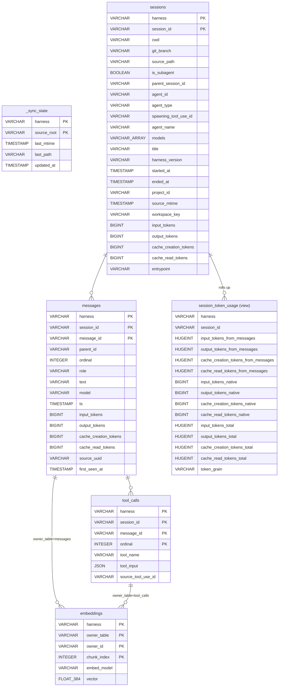

# Warehouse schema

Logical relationships only — DuckDB has no FOREIGN KEY constraints (deliberate).

Indexes (including the embeddings HNSW index) are omitted; they are snapshot data, not query-forming structure.
